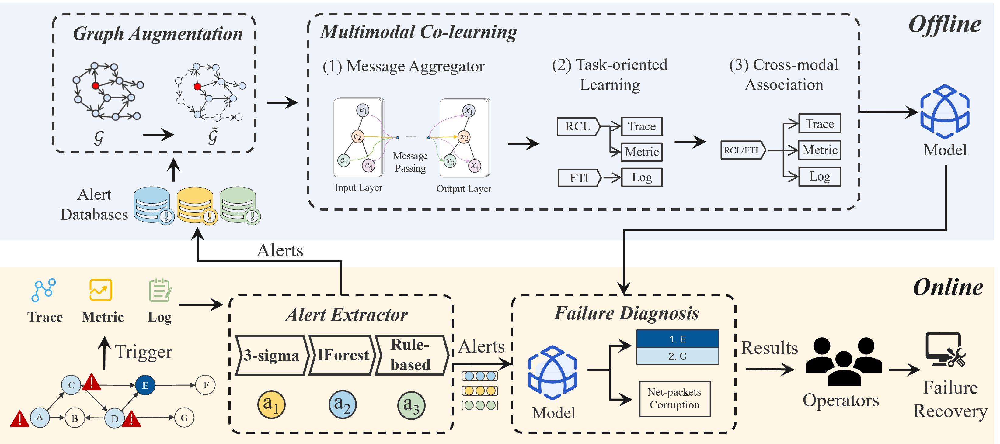
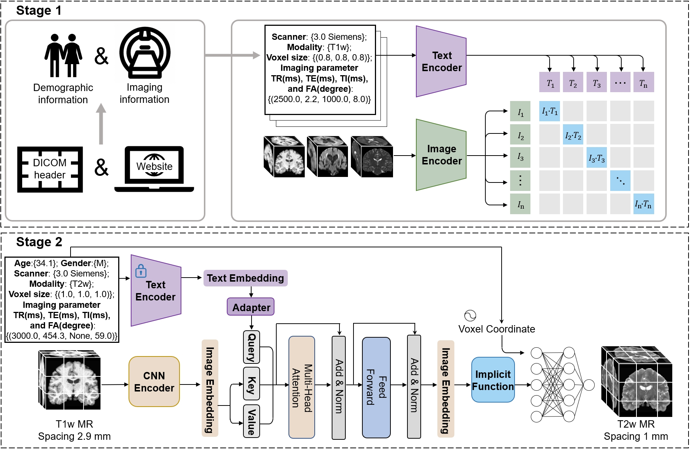
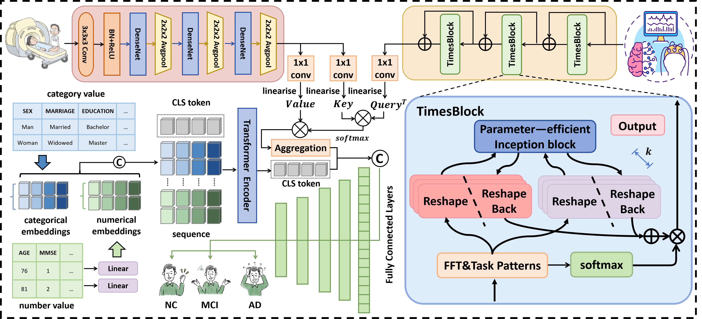
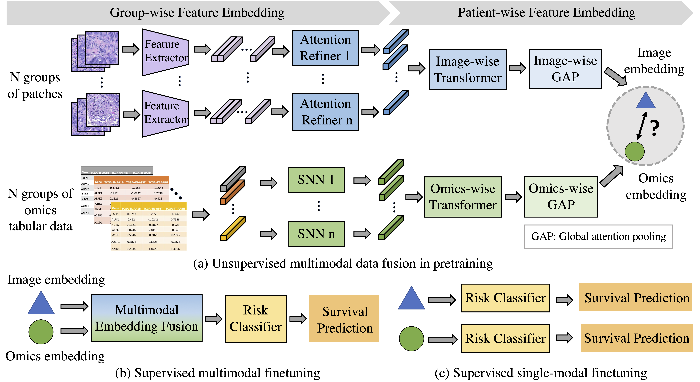
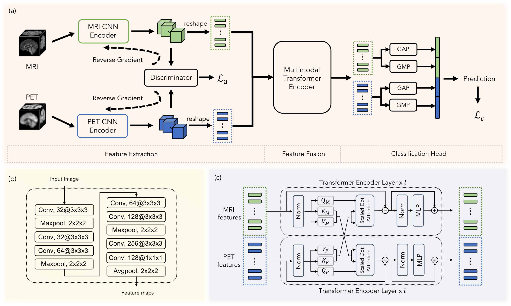
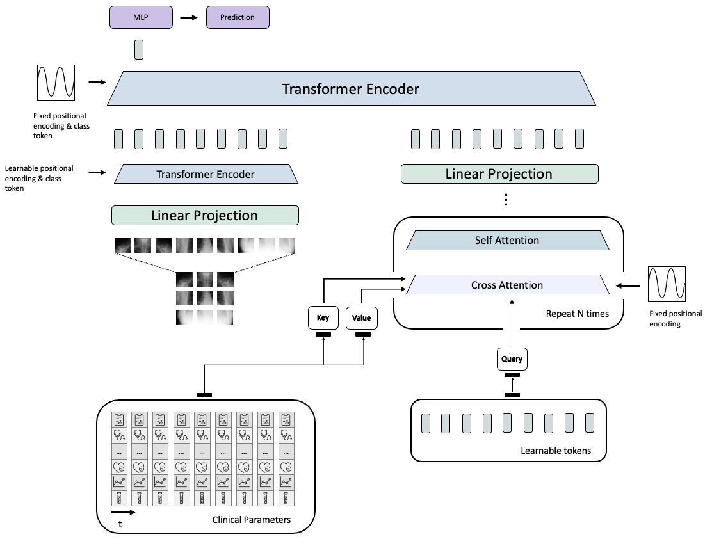
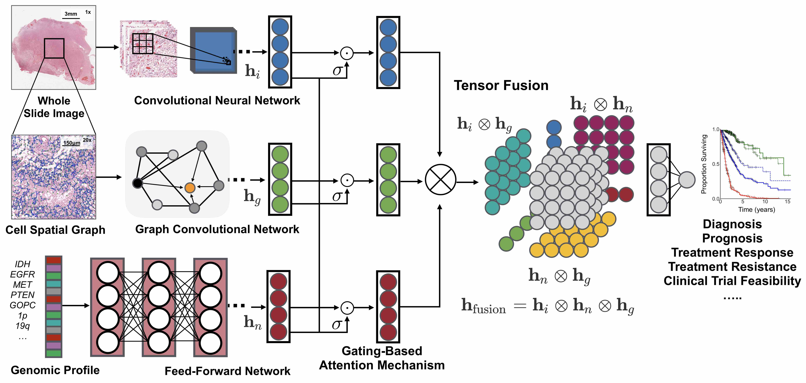

# Multimodal-Medical-Diagnosis-papers
多模态医疗诊断相关论文以及代码
### [1.TVDiag: A Task-oriented and View-invariant Failure Diagnosis Framework with Multimodal Data](https://github.com/WHU-AISE/TVDiag/tree/main)

### [2.Towards General Text-guided Universal Image Synthesis for Customized Multimodal Brain MRI Generation](https://github.com/Wangyulin-user/TUMSyn)

### [3.Multi-modal Fusion](https://github.com/hrlblab/CS-MIL/tree/main)
 
### [4.MSTNet](https://github.com/JustlfC03/MSTNet/tree/main)

### [5.PathOmics: Pathology-and-genomics Multimodal Transformer for Survival Outcome Prediction](https://github.com/Cassie07/PathOmics/tree/main)

### [6.Transformer-based Multimodal Fusion for Early Diagnosis of Alzheimer’s Disease Using Structural MRI and PET](https://github.com/Kateridge/TransMF_AD)

### [7.Medical Diagnosis with Large Scale Multimodal Transfomer](https://github.com/firasgit/lsmt)

### [8.Pathomic Fusion: An Integrated Framework for Fusing Histopathology and Genomic Features for Diagnosis and Prognosis](https://github.com/mahmoodlab/PathomicFusion)

### [9.Multimodal Attention for Alzheimer's Disease Classification](https://github.com/rsinghlab/maddi)

### [10.Code for MedFuse: Multi-modal fusion and benchmarking with clinical time-series and chest X-ray images](https://github.com/nyuad-cai/medfuse)

